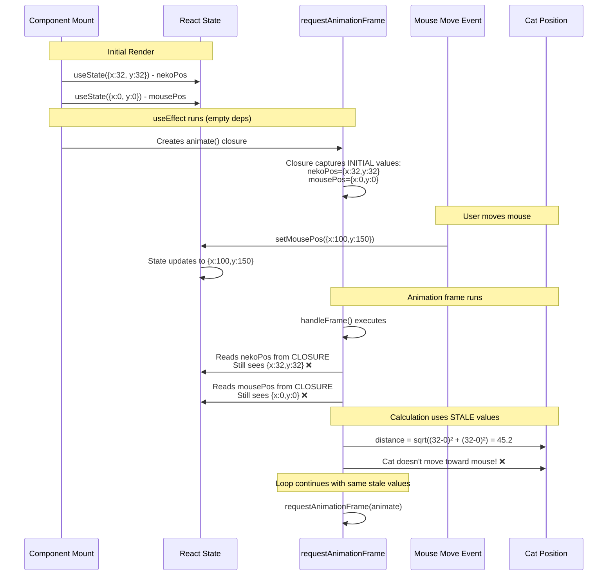
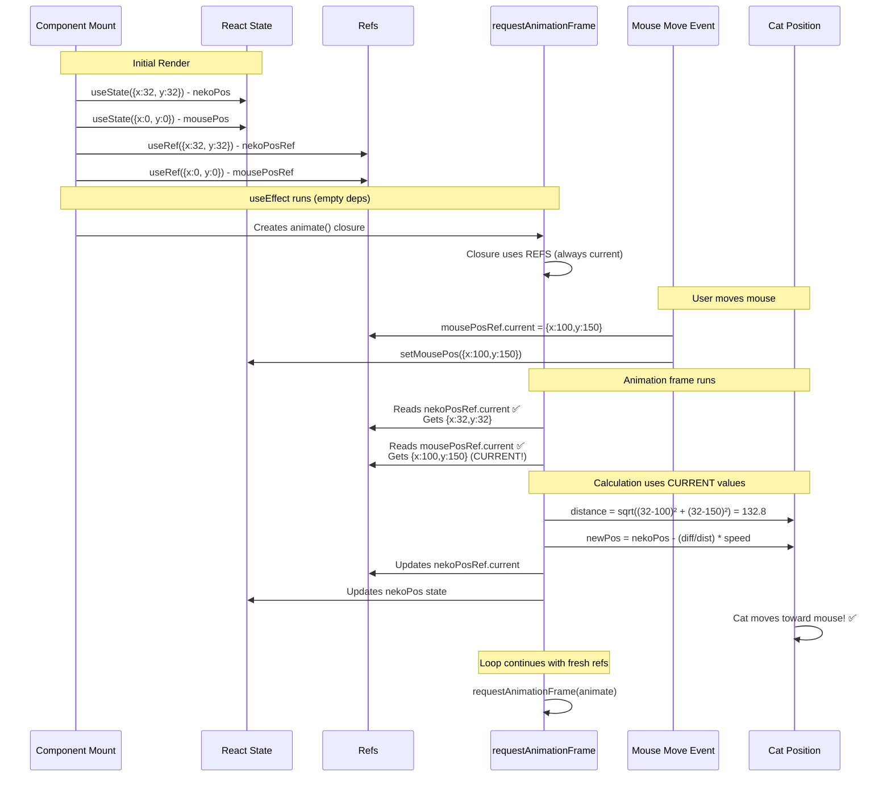

# OnekoCat Fix: Stale State vs Refs Solution

## Problem: Old Implementation (❌ Broken)

## Solution: New Implementation (✅ Fixed)

## Flow Comparison

```mermaid
flowchart TB
    subgraph Old["Old Implementation - Broken"]
        O1[Component Mount] --> O2[useState: nekoPos, mousePos]
        O2 --> O3[useEffect creates RAF closure]
        O3 --> O4[RAF Closure Captures Initial State Values]
        O4 --> O5["nekoPos = x:32, y:32<br/>mousePos = x:0, y:0"]
        O5 --> O6[User Moves Mouse]
        O6 --> O7[State Updates]
        O7 --> O8[RAF Reads from Closure]
        O8 --> O9[Still Sees OLD Values]
        O9 --> O10[Cat Does Not Follow]
        O10 --> O11[Potential NaN if distance=0]
    end

    subgraph New["New Implementation - Fixed"]
        N1[Component Mount] --> N2[useState + useRef]
        N2 --> N3[useEffect creates RAF closure]
        N3 --> N4[RAF Closure Uses Refs Always Current]
        N4 --> N5["nekoPosRef.current<br/>mousePosRef.current"]
        N5 --> N6[User Moves Mouse]
        N6 --> N7["Update mousePosRef.current<br/>+ setState"]
        N7 --> N8[RAF Reads from Refs]
        N8 --> N9[Gets CURRENT Values]
        N9 --> N10[Cat Follows Smoothly]
        N10 --> N11[NaN Guards Prevent Errors]
        N11 --> N12[Fallback Sprites]
    end

    style Old fill:#ffebee
    style New fill:#e8f5e9
    style O9 fill:#ffcdd2
    style O10 fill:#ffcdd2
    style O11 fill:#ffcdd2
    style N9 fill:#c8e6c9
    style N10 fill:#c8e6c9
    style N11 fill:#c8e6c9
    style N12 fill:#c8e6c9
```

## Key Differences

| Aspect               | Old ❌                            | New ✅                                     |
| -------------------- | --------------------------------- | ------------------------------------------ |
| **State Access**     | Reads from closure-captured state | Reads from refs (always current)           |
| **Mouse Position**   | Stale initial value {x:0, y:0}    | Current value from `mousePosRef.current`   |
| **Cat Position**     | Stale initial value {x:32, y:32}  | Current value from `nekoPosRef.current`    |
| **Division by Zero** | No guard, can produce NaN         | `Number.isFinite()` + `distance > 0` check |
| **Sprite Fallback**  | No validation                     | Checks `direction in SPRITE_SETS`          |
| **Result**           | Cat never moves                   | Cat follows cursor smoothly                |

## Fix Summary

1. **Stale State Fix**: Refs provide current values to RAF loop
2. **NaN Prevention**: Guards check `Number.isFinite()` and `distance > 0`
3. **Sprite Safety**: Validates direction exists in SPRITE_SETS, falls back to "idle"
4. **Synchronization**: Refs updated immediately, state updated for re-renders
